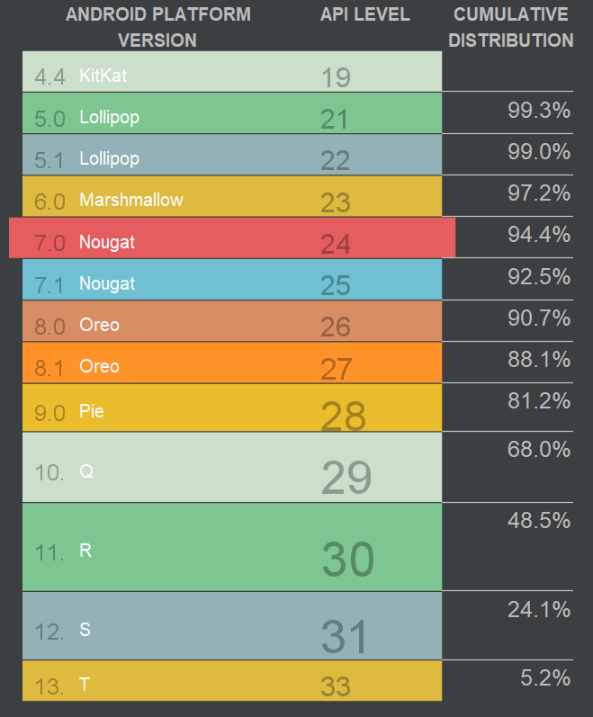

## AndroidProgramming 🚌

1. ### [Kotlin](./Kotlin)
    - `Kotlin` 언어의 기초
    - 함수, 클래스, 상속 등 공부
2. ### [AndroidStudio](./AndroidStudio)
    - `Kotlin` 으로 `Android 앱` 작성해보기

        
    - 안드로이드 버전과 관련된 표